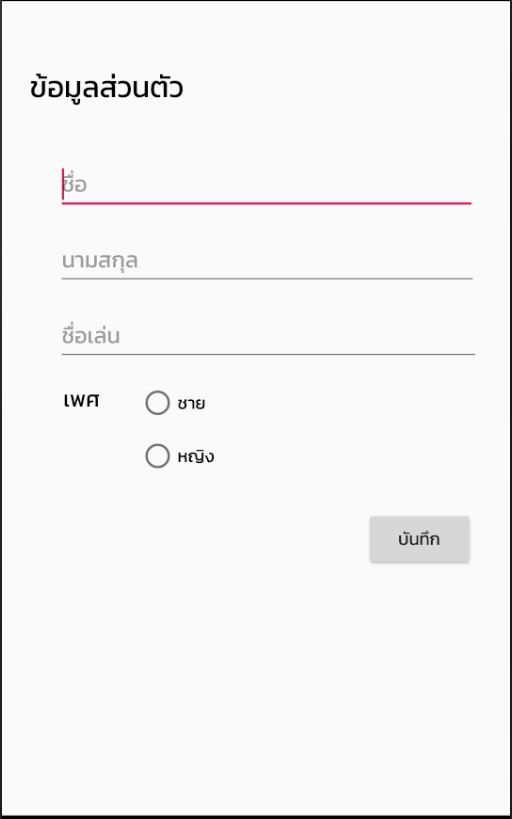
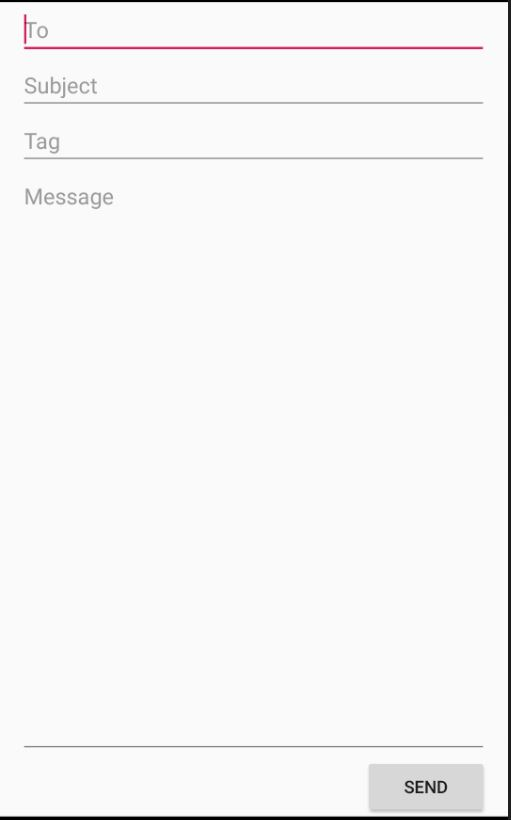

# รายงานผลการทดลอง

นาย ทรัพย์ทวี  เพ็ชรสาย   603410203-8

## Relative Layout

แสดง Control `title` และ `Detail`

<div>

</div>

<br/>


```xml
<RelativeLayout
    xmlns:android="http://schemas.android.com/apk/res/android"
    xmlns:app="http://schemas.android.com/apk/res-auto"
    xmlns:tools="http://schemas.android.com/tools"
    android:layout_width="match_parent"
    android:layout_height="match_parent"
    tools:context=".Relative_lyout">


    <TextView
        android:id="@+id/textView4"
        android:layout_width="160dp"
        android:layout_height="41dp"
        android:layout_alignParentStart="true"
        android:layout_alignParentTop="true"
        android:layout_alignParentEnd="true"
        android:layout_marginStart="23dp"
        android:layout_marginTop="52dp"
        android:layout_marginEnd="228dp"
        android:fontFamily="@font/kanit"
        android:text="ข้อมูลส่วนตัว"
        android:textColor="#FA000000"
        android:textSize="24sp" />

    <EditText
        android:id="@+id/fname"
        android:layout_width="319dp"
        android:layout_height="wrap_content"
        android:layout_below="@+id/textView4"
        android:layout_alignStart="@+id/textView4"
        android:layout_alignParentEnd="true"
        android:layout_marginStart="22dp"
        android:layout_marginTop="32dp"
        android:layout_marginEnd="27dp"
        android:ems="10"
        android:fontFamily="@font/kanit"
        android:inputType="textPersonName"
        android:hint="ชื่อ" />

    <EditText
        android:id="@+id/lname"
        android:layout_width="319dp"
        android:layout_height="wrap_content"
        android:layout_below="@+id/fname"
        android:layout_alignStart="@+id/fname"
        android:layout_alignParentEnd="true"
        android:layout_marginStart="0dp"
        android:layout_marginTop="15dp"
        android:layout_marginEnd="26dp"
        android:ems="10"
        android:fontFamily="@font/kanit"
        android:inputType="textPersonName"
        android:hint="นามสกุล" />

    <EditText
        android:id="@+id/lname2"
        android:layout_width="319dp"
        android:layout_height="wrap_content"
        android:layout_below="@+id/lname"
        android:layout_alignStart="@+id/lname"
        android:layout_alignParentEnd="true"
        android:layout_marginStart="0dp"
        android:layout_marginTop="15dp"
        android:layout_marginEnd="24dp"
        android:ems="10"
        android:fontFamily="@font/kanit"
        android:inputType="textPersonName"
        android:hint="ชื่อเล่น" />

    <TextView
        android:id="@+id/textView6"
        android:layout_width="wrap_content"
        android:layout_height="wrap_content"
        android:layout_below="@+id/lname2"
        android:layout_alignStart="@+id/lname2"
        android:layout_marginStart="5dp"
        android:layout_marginTop="15dp"
        android:fontFamily="@font/kanit"
        android:text="เพศ"
        android:textColor="#F2000000"
        android:textSize="18sp" />

    <RadioButton
        android:id="@+id/radioButton"
        android:layout_width="105dp"
        android:layout_height="wrap_content"
        android:layout_alignTop="@+id/textView6"
        android:layout_marginStart="31dp"
        android:layout_marginTop="0dp"
        android:layout_toEndOf="@+id/textView6"
        android:fontFamily="@font/kanit"
        android:text="ชาย" />

    <RadioButton
        android:id="@+id/radioButton2"
        android:layout_width="106dp"
        android:layout_height="wrap_content"
        android:layout_below="@+id/radioButton"
        android:layout_alignStart="@+id/radioButton"
        android:layout_marginTop="11dp"
        android:fontFamily="@font/kanit"
        android:text="หญิง" />

    <Button
        android:id="@+id/button"
        android:layout_width="wrap_content"
        android:layout_height="wrap_content"
        android:layout_below="@+id/lname2"
        android:layout_alignStart="@+id/radioButton2"
        android:layout_marginStart="184dp"
        android:layout_marginTop="117dp"
        android:fontFamily="@font/kanit"
        android:text="บันทึก" />

</RelativeLayout>
```

แอดทริบิ้วที่แสดงความสัมพันธ์ระหว่าง control ทั้งสอง

```xml

<!-- ยกตัวอย่าง -->
<!-- RelativeLayout คือ เครื่องมือที่ช่วยจัดเรียงหน้า UI ให้อย่างที่เราต้องการ 
จาก xml ข้างบนจะเห็นได้ว่า ปุ่ม Button บันทึก จะมีความสัมพันธ์กับ EditText ชื่อว่า nickname คือ  ปุ่ม Button บันทึก จะอยู่ใต้ EditText ชื่อว่า nickname 
เพราะว่าผมได้เชื่อมความสัมพันธ์กัน โดยใช้คำสั่ง layout_below คือ Button อยู่ข้างล่าง nickname และตั้ง marginTop เพื่อเว้นระยะห่างจาก nickname ลงมา
ถ้ามีการเคลื่อนย้าน EditText ชื่อว่า nickname ปุ่ม Button ก็จะตามไปทุกที่แต่ ต้องยึดไว้ 2 ทาง -->
android:layout_below="@+id/nickname"   
android:layout_marginTop="117dp"
```

## Linear Layout

แสดง Control `to`, `subject`, `tag` และ `message`

<div>

</div>

<br/>


```xml
    <LinearLayout
        android:layout_width="match_parent"
        android:layout_height="match_parent"
        android:orientation="vertical"
        android:paddingLeft="16dp"
        android:paddingRight="16dp">

        <EditText
            android:id="@+id/editText"
            android:layout_width="match_parent"
            android:layout_height="wrap_content"
            android:ems="10"
            android:inputType="textPersonName"
            android:hint="To"
            android:textAlignment="viewStart" />

        <EditText
            android:id="@+id/editText2"
            android:layout_width="match_parent"
            android:layout_height="wrap_content"
            android:ems="10"
            android:inputType="textPersonName"
            android:hint="Subject"
            android:textAlignment="viewStart" />

        <EditText
            android:id="@+id/editText3"
            android:layout_width="match_parent"
            android:layout_height="wrap_content"
            android:ems="10"
            android:inputType="textPersonName"
            android:hint="Tag"
            android:textAlignment="viewStart" />

        <EditText
            android:id="@+id/editText4"
            android:layout_width="match_parent"
            android:layout_height="522dp"
            android:layout_weight="1"
            android:ems="10"
            android:hint="Message"
            android:inputType="textPersonName"
            android:textAlignment="gravity"
            android:gravity="top"/>

        <Button
            android:id="@+id/button2"
            android:layout_width="100dp"
            android:layout_height="wrap_content"
            android:layout_gravity="right"
            android:text="Send" />
    </LinearLayout>
```

อธิบายความแตกต่างระหว่าง vertical และ horizontal orientation

```
Vertical  Orientation  คือ layout ที่ทำให้เราจัดเรียงหน้าตา UI แนวตั้ง
          ____________________________________
          ____________________________________
          ____________________________________

Horizontal  Orientation  คือ  layout ที่ทำให้เราจัดเรียงหน้าตา UI แนวนอน

          |           ||          ||          |
          |           ||          ||          |
          |           ||          ||          |

```

## Constrant Layout

จงออกแบบและสร้างหน้า Constrant layout สำหรับแสดงข้อมูลนักศึกษา ประกอบไปด้วย รูปโปรไฟล์ รูปพื้นหลัง ชื่อ-นามสกุล รหัสนักศึกษา และเกรดเฉลี่ยรวม

<div>

</div>

<br/>


```xml
<?xml version="1.0" encoding="utf-8"?>
<androidx.constraintlayout.widget.ConstraintLayout xmlns:android="http://schemas.android.com/apk/res/android"
    xmlns:app="http://schemas.android.com/apk/res-auto"
    xmlns:tools="http://schemas.android.com/tools"
    android:layout_width="match_parent"
    android:layout_height="match_parent"
    tools:context=".Constrant_Layout">

    <ScrollView
        android:layout_width="match_parent"
        android:layout_height="match_parent">

        <LinearLayout
            android:layout_width="match_parent"
            android:layout_height="wrap_content"
            android:orientation="vertical" >

            <androidx.constraintlayout.widget.ConstraintLayout
                android:layout_width="match_parent"
                android:layout_height="match_parent">

                <ImageView
                    android:id="@+id/coverprofile"
                    android:layout_width="0dp"
                    android:layout_height="255dp"
                    android:contentDescription="TODO"
                    android:scaleType="centerCrop"
                    app:layout_constrainedHeight="false"
                    app:layout_constrainedWidth="false"
                    app:layout_constraintEnd_toEndOf="parent"
                    app:layout_constraintHorizontal_bias="0.0"
                    app:layout_constraintStart_toStartOf="parent"
                    app:layout_constraintTop_toTopOf="parent"
                    app:srcCompat="@drawable/coverprofile" />

                <de.hdodenhof.circleimageview.CircleImageView
                    android:id="@+id/profile"
                    android:layout_width="wrap_content"
                    android:layout_height="202dp"
                    android:layout_marginTop="148dp"
                    android:src="@drawable/profile"
                    app:civ_border_color="#2588FD"
                    app:civ_border_width="5dp"
                    app:layout_constraintEnd_toEndOf="parent"
                    app:layout_constraintHorizontal_bias="1.0"
                    app:layout_constraintStart_toEndOf="@+id/coverprofile"
                    app:layout_constraintTop_toTopOf="parent" />

            </androidx.constraintlayout.widget.ConstraintLayout>

            <androidx.constraintlayout.widget.ConstraintLayout
                android:layout_width="match_parent"
                android:layout_height="252dp">

                <TextView
                    android:id="@+id/NameProfile"
                    android:layout_width="wrap_content"
                    android:layout_height="wrap_content"
                    android:layout_marginTop="16dp"
                    android:text="@string/name_profile"
                    android:textAlignment="center"
                    android:textColor="#2B2B2B"
                    android:textSize="30sp"
                    android:textStyle="bold"
                    app:layout_constraintEnd_toEndOf="parent"
                    app:layout_constraintHorizontal_bias="0.5"
                    app:layout_constraintStart_toStartOf="parent"
                    app:layout_constraintTop_toTopOf="parent" />

                <TextView
                    android:id="@+id/gradename"
                    android:layout_width="wrap_content"
                    android:layout_height="wrap_content"
                    android:layout_marginTop="32dp"
                    android:fontFamily="@font/kanit"
                    android:text="@string/gradename"
                    android:textColor="#050000"
                    android:textSize="18sp"
                    app:layout_constraintEnd_toEndOf="parent"
                    app:layout_constraintHorizontal_bias="0.24"
                    app:layout_constraintStart_toStartOf="parent"
                    app:layout_constraintTop_toTopOf="@+id/idstudentname" />

                <TextView
                    android:id="@+id/grade2"
                    android:layout_width="28dp"
                    android:layout_height="wrap_content"
                    android:layout_marginStart="156dp"
                    android:layout_marginTop="33dp"
                    android:fontFamily="@font/kanit"
                    android:text="@string/grade"
                    android:textSize="18sp"
                    app:layout_constraintStart_toEndOf="@+id/gradename"
                    app:layout_constraintTop_toBottomOf="@+id/nameuse" />

                <TextView
                    android:id="@+id/name"
                    android:layout_width="wrap_content"
                    android:layout_height="wrap_content"
                    android:layout_marginTop="58dp"
                    android:fontFamily="@font/kanit"
                    android:text="@string/name"
                    android:textColor="#070000"
                    android:textSize="18sp"
                    app:layout_constraintBottom_toBottomOf="@+id/NameProfile"
                    app:layout_constraintEnd_toEndOf="@+id/NameProfile"
                    app:layout_constraintEnd_toStartOf="@+id/NameProfile"
                    app:layout_constraintHorizontal_bias="1.0"
                    app:layout_constraintStart_toEndOf="@+id/idstudentname"
                    app:layout_constraintStart_toStartOf="@+id/NameProfile"
                    app:layout_constraintTop_toTopOf="@+id/NameProfile"
                    app:layout_constraintVertical_bias="0.127" />

                <TextView
                    android:id="@+id/idstudentname"
                    android:layout_width="wrap_content"
                    android:layout_height="wrap_content"
                    android:fontFamily="@font/kanit"
                    android:text="@string/idstudentname"
                    android:textColor="#020000"
                    android:textSize="18sp"
                    app:layout_constraintEnd_toEndOf="parent"
                    app:layout_constraintHorizontal_bias="0.257"
                    app:layout_constraintStart_toStartOf="parent"
                    app:layout_constraintTop_toBottomOf="@+id/name" />

                <TextView
                    android:id="@+id/nameuse"
                    android:layout_width="wrap_content"
                    android:layout_height="wrap_content"
                    android:layout_marginTop="52dp"
                    android:fontFamily="@font/kanit"
                    android:text="@string/nameuse"
                    android:textSize="18sp"
                    app:layout_constraintEnd_toEndOf="parent"
                    app:layout_constraintStart_toEndOf="@+id/name"
                    app:layout_constraintTop_toTopOf="@+id/NameProfile" />

                <TextView
                    android:id="@+id/idstudent"
                    android:layout_width="wrap_content"
                    android:layout_height="wrap_content"
                    android:layout_marginStart="141dp"
                    android:layout_marginTop="32dp"
                    android:fontFamily="@font/kanit"
                    android:text="@string/idstudent"
                    android:textSize="18sp"
                    app:layout_constraintEnd_toEndOf="parent"
                    app:layout_constraintHorizontal_bias="0.18"
                    app:layout_constraintStart_toStartOf="@+id/idstudentname"
                    app:layout_constraintTop_toTopOf="@+id/nameuse" />

            </androidx.constraintlayout.widget.ConstraintLayout>

        </LinearLayout>
    </ScrollView>

</androidx.constraintlayout.widget.ConstraintLayout>
```
